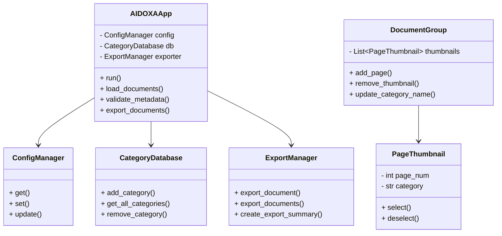

# Executive Summary
DynamicAI è un **editor documentale avanzato** scritto in Python, progettato per gestire documenti multipagina (PDF e TIFF) e dividerli in documenti singoli sulla base di un file JSON di struttura.  
Il programma permette di:
- Caricare documenti multipagina (PDF/TIFF).
- Leggere un file JSON di riferimento che contiene:
  - intervalli di pagine (`inizio`, `fine`),
  - categorie documentali,
  - metadati di intestazione (es. NumeroProgetto, Intestatario, IndirizzoImmobile, LavoroEseguito, EstremiCatastali).
- Creare **gruppi documentali** organizzati per categoria, con miniature e contatore progressivo.
- Consentire all’operatore la **validazione e modifica manuale dei metadati**.
- Esportare i documenti in diversi formati (JPEG, PDF singolo, PDF multipagina, TIFF singolo, TIFF multipagina) con gestione avanzata dei conflitti di file.
- Generare un **CSV riepilogativo** con tutti i metadati associati ai file esportati.

DynamicAI è dotato di un’interfaccia grafica Tkinter, configurabile tramite un file JSON utente, e utilizza un database SQLite per la gestione delle categorie documentali.

---

# Sommario
1. [Panoramica del Progetto](#1-panoramica-del-progetto)  
2. [Inventario dei File](#2-inventario-dei-file)  
3. [Dipendenze & Ambiente](#3-dipendenze--ambiente)  
4. [Configurazione](#4-configurazione)  
5. [Flusso Dati](#5-flusso-dati)  
6. [Architettura & Design](#6-architettura--design)  
7. [Esecuzione, Build & Distribuzione](#7-esecuzione-build--distribuzione)  
8. [Persistenza, I/O e Integrazioni](#8-persistenza-io-e-integrazioni)  
9. [Qualità, Robustezza, Sicurezza](#9-qualità-robustezza-sicurezza)  
10. [Onboarding & Operatività](#10-onboarding--operatività)  
11. [Roadmap & Domande Aperte](#11-roadmap--domande-aperte)  
12. [Appendici](#appendici)

---

# 1. Panoramica del Progetto
- **Nome**: DynamicAI (alias DocumentAI)  
- **Versione**: 3.5 (dichiarata in `config/constants.py`)  
- **Obiettivo**: semplificare la suddivisione e classificazione di documenti multipagina, aggiungendo metadati strutturati e producendo output multipiattaforma.  
- **Utenti target**: operatori che gestiscono pratiche documentali (edilizie, amministrative, ecc.), integratori software, sviluppatori.  
- **Tecnologie chiave**: Python 3.10+, Tkinter, PyMuPDF, PIL (Pillow), SQLite, PyInstaller.  

---

# 2. Inventario dei File
### Struttura generale
```
DynamicAI/
├── main.py
├── README.md
├── assets/
│   └── icons/ (documentai.ico, documentai.png)
├── config/
│   ├── __init__.py
│   ├── settings.py
│   └── constants.py
├── database/
│   ├── __init__.py
│   └── category_db.py
├── export/
│   ├── __init__.py
│   └── export_manager.py
├── gui/
│   ├── __init__.py
│   ├── main_window.py
│   ├── components/
│   │   ├── __init__.py
│   │   ├── thumbnail.py
│   │   └── document_group.py
│   └── dialogs/
│       ├── __init__.py
│       ├── settings_dialog.py
│       └── category_dialog.py
├── loaders/
│   ├── __init__.py
│   └── document_loaders.py
└── utils/
    ├── __init__.py
    ├── helpers.py
    └── branding.py
```

### File principali
- **main.py**: entry point, avvia `AIDOXAApp` (GUI).  
- **gui/main_window.py**: finestra principale, orchestrazione logica applicativa.  
- **config/constants.py**: configurazione di default (UI, export, app info).  
- **config/settings.py**: gestione file config utente.  
- **database/category_db.py**: gestione categorie in SQLite.  
- **export/export_manager.py**: gestione export in PDF, TIFF, JPEG, CSV.  
- **loaders/document_loaders.py**: caricamento documenti multipagina PDF/TIFF.  
- **utils/helpers.py**: dialoghi di supporto, validazioni, funzioni di sistema.  
- **utils/branding.py**: gestione risorse e icone (compatibile con PyInstaller).  
- **gui/components/**: widget riutilizzabili (`PageThumbnail`, `DocumentGroup`).  
- **gui/dialogs/**: finestre di dialogo (`SettingsDialog`, `CategorySelectionDialog`).  

---

# 3. Dipendenze & Ambiente
- **Python**: >= 3.10  
- **Librerie**:
  - `tkinter` (GUI)  
  - `pillow` (gestione immagini)  
  - `pymupdf` (`fitz`, per i PDF)  
  - `sqlite3` (DB categorie)  
- **Sistema**:
  - Cross-platform (Windows, Linux, macOS).  
  - Supporto packaging con **PyInstaller**.  

---

# 4. Configurazione
- **File di configurazione**: `settings.json` in `%APPDATA%/DynamicAI` (Windows) o `~/.config/DynamicAI` (Linux/Mac).  
- **DEFAULT_CONFIG** (`config/constants.py`):
  - UI: tema chiaro, lingua `it`, font Arial 10 bold.  
  - Export: formato default `JPEG`, qualità 95, compressione TIFF, CSV delimiter `;`.  
  - File handling: auto_rename / ask_overwrite / always_overwrite.  
  - Altro: salvataggio layout finestre, dimensione miniature, debug info.  
- **Gestione**:
  - `ConfigManager`: API `get`, `set`, `update`.  
  - Salvataggio atomico (file temporaneo + replace).  

---

# 5. Flusso Dati
```mermaid
flowchart TD

    subgraph INPUT[Input Files]
        PDF[📄 File PDF multipagina]
        TIFF[🖼️ File TIFF multipagina]
        JSON[🗂️ File JSON di struttura e metadati]
    end

    subgraph PROCESSING[DynamicAI - Elaborazione]
        PARSER[🔎 Parser JSON<br/>Categorie + Header Metadati]
        SPLITTER[✂️ Document Splitter<br/>Divisione multipagina in documenti]
        METADATA[🏷️ Metadata Assigner<br/>Assegna NumeroProgetto, Intestatario, ecc.]
        VALIDATION[👤 Operatore<br/>Validazione e correzione metadati]
    end

    subgraph OUTPUT[Output Files]
        DOCS[📂 Documenti separati<br/>(PDF/TIFF singoli)]
        CSV[📑 CSV con metadati validati]
    end

    PDF --> SPLITTER
    TIFF --> SPLITTER
    JSON --> PARSER --> SPLITTER
    SPLITTER --> METADATA --> VALIDATION --> DOCS
    VALIDATION --> CSV
```

---

# 6. Architettura & Design
### Componenti principali
- **GUI** (`main_window.py`)  
  - Pannelli: sinistro (lista documenti), centrale (preview immagini), destro (metadati).  
  - Integrazione con `CategoryDatabase`, `ConfigManager`, `ExportManager`.  
- **Database** (`category_db.py`)  
  - Gestione categorie in SQLite con update automatico `last_used`.  
- **Loader** (`document_loaders.py`)  
  - PDF loader con cache immagini (PyMuPDF).  
  - TIFF loader multipagina (PIL).  
- **Export Manager** (`export_manager.py`)  
  - Export robusto, gestione file esistenti, CSV riepilogativo.  
- **Utils** (`helpers.py`, `branding.py`)  
  - Dialoghi (Help, About, Progress).  
  - Gestione path risorse e icone (compatibile PyInstaller).  

### Diagramma Classi (semplificato)


---

# 7. Esecuzione, Build & Distribuzione
- **Avvio da sorgente**:
  ```bash
  python main.py
  ```
- **Build con PyInstaller**:
  - Spec file: `DynamicAI_with_icon.spec`  
  - Integrazione icone: `documentai.ico` (eseguibile), `documentai.png` (UI).  
- **Output distribuzione**:
  - Eseguibile standalone per Windows.  
  - Compatibilità Linux/Mac via Python interpreter.  

---

# 8. Persistenza, I/O e Integrazioni
- **DB SQLite**: gestione categorie (`categories` con `id`, `name`, `created_date`, `last_used`).  
- **File system**:  
  - Input/Output folder configurabili.  
  - Salvataggio sicuro con file temporanei e backup.  
- **CSV export**:  
  - Generato automaticamente in base ai documenti esportati.  
  - Include metadati validati.  
- **Logging**: attualmente minimo (stampe console), migliorabile.  

---

# 9. Qualità, Robustezza, Sicurezza
- **Gestione errori**: try/except diffusi in loaders, database, export.  
- **Robustezza**:
  - Caching PDF per performance.  
  - Export atomico con file temporanei.  
- **Criticità**:
  - Logging poco strutturato.  
  - Mancanza test unitari.  
  - Possibile elevato uso memoria con PDF grandi.  
- **Sicurezza**:
  - Input JSON non validato formalmente.  
  - Sanitizzazione nomi file implementata (`sanitize_filename`).  

---

# 10. Onboarding & Operatività
### Checklist “Primi 60 minuti”
1. Clonare repository.  
2. Creare virtualenv Python 3.10+.  
3. Installare dipendenze (`pip install pillow pymupdf`).  
4. Lanciare `python main.py`.  
5. Aprire documento PDF/TIFF + JSON di esempio.  
6. Testare validazione categorie/metadati.  
7. Eseguire export e verificare output CSV.  

### FAQ
- **Come aggiungo una nuova categoria?**  
  → Via `CategorySelectionDialog` o inserendo direttamente nel DB SQLite.  
- **Dove si trova il file di configurazione?**  
  → `%APPDATA%/DynamicAI/settings.json` (Windows) o `~/.config/DynamicAI`.  
- **Cosa succede se il JSON non è valido?**  
  → L’app non divide correttamente i documenti, l’utente deve correggerlo.  
- **Posso cambiare il delimitatore CSV?**  
  → Sì, nelle impostazioni export.  
- **È possibile personalizzare font e layout?**  
  → Sì, nel pannello impostazioni.  

---

# 11. Roadmap & Domande Aperte
### Miglioramenti suggeriti
1. **Logging strutturato** (file log + livelli debug/info/error).  
2. **Validazione schema JSON** con libreria dedicata.  
3. **Test unitari** per loaders, export, db.  
4. **Gestione batch massivi** (ottimizzazione memoria).  
5. **GUI migliorata** (toolbar, dark mode, shortcut estesi).  
6. **Integrazione OCR opzionale** per metadati automatici.  
7. **Plugin system** per supporto altri formati (DOCX, PNG multipagina).  
8. **Porting a framework GUI moderno** (es. PySide/Qt).  

### Domande aperte
- Esiste uno schema ufficiale del JSON o varia per cliente?  
- Il CSV è sempre obbligatorio o opzionale?  
- L’export può includere anche i file JSON originali per tracciabilità?  
- Sono previsti connettori verso sistemi esterni (ERP, DMS)?  

---

# Appendici
## A. Albero Progetto
(vedi sezione [Inventario dei File](#2-inventario-dei-file))  

## B. Funzioni/Classi principali
- **AIDOXAApp**: GUI principale.  
- **DocumentGroup** / **PageThumbnail**: organizzazione documenti/pagine.  
- **SettingsDialog**, **CategorySelectionDialog**: dialoghi configurazione/categorie.  
- **ConfigManager**: gestione file config JSON.  
- **CategoryDatabase**: DB SQLite categorie.  
- **ExportManager**: export file multipiattaforma + CSV.  
- **PDFDocumentLoader**, **TIFFDocumentLoader**: caricamento documenti multipagina.  
- **Helpers**: funzioni di supporto (help, about, progress).  

## C. Glossario
- **JSON**: file di struttura, definisce categorie e metadati.  
- **CSV**: file tabellare con metadati documenti esportati.  
- **PyInstaller**: tool di packaging Python → eseguibile standalone.  
- **Thumbnail**: miniatura grafica di una pagina.  
- **Categoria**: etichetta per classificare un documento.  

---
